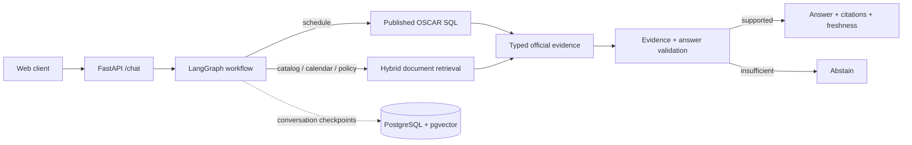

# BuzzBot Backend

> Evidence-first retrieval backend for a Georgia Tech student assistant.

BuzzBot Backend is the FastAPI service behind BuzzBot. It combines structured OSCAR schedule data with a controlled corpus of official Georgia Tech documents and returns grounded answers with citations, source metadata, and freshness context.

The core design goal is reliability over autonomy: LangGraph orchestrates a bounded retrieval workflow, evidence is validated before generation, recovery is limited, and the system abstains when it cannot support an answer from trusted sources.

## Highlights

- **Two retrieval paths for two kinds of facts** — deterministic SQL handles course offerings and section data; document retrieval handles Catalog, Academic Calendar, policy, admissions, finance, housing, and other official sources.
- **Hybrid document retrieval** — combines pgvector similarity, PostgreSQL full-text search, reciprocal-rank fusion, URL diversification, and cross-encoder reranking.
- **Citation-first validation** — answers are checked against retrieved official URLs and supporting evidence before they are returned.
- **Versioned data ingestion** — bounded source discovery, immutable manifests, content hashing, and transactional publication keep the last trusted dataset available when a refresh fails.
- **Typed conversation workflow** — normalized intents and fields drive explicit retrieval tools, with one bounded recovery path instead of an open-ended model loop.
- **Production trust boundaries** — optional Firebase bearer verification, request identity isolation, configurable proxy trust, readiness checks, and non-root container execution.
- **Evaluation-driven development** — fixed schedule, retrieval, citation, and answer-quality gates make regressions measurable rather than subjective.

## Architecture



Schedule answers can be rendered deterministically from structured data. Document questions retrieve official evidence first and only then use the configured model for synthesis.

## Retrieval and data pipeline

### Structured schedule data

Published OSCAR data is normalized into versioned course, section, and meeting records. A refresh is validated before publication; failed validation does not replace the previous trusted version.

### Official documents

Document sources are drawn from a controlled registry of Georgia Tech domains and seed URLs. The ingestion pipeline:

1. discovers and canonicalizes bounded URLs,
2. stores an immutable run manifest,
3. fetches and extracts changed content,
4. chunks and embeds new content,
5. publishes searchable metadata and vectors to PostgreSQL.

Conditional requests and content hashes avoid unnecessary reprocessing.

### Hybrid retrieval

Document search combines:

1. pgvector cosine similarity,
2. PostgreSQL full-text search,
3. reciprocal-rank fusion,
4. source diversification,
5. cross-encoder reranking,
6. stable deduplication into typed evidence.

There is no unrestricted web-search fallback in the production path.

## Evaluation snapshot

The current backend includes fixed regression gates for schedule, retrieval, and grounded-answer quality.

| Evaluation | Result |
| --- | ---: |
| Schedule SQL | 150 / 150 |
| Schedule NLU | 150 / 150 |
| Schedule renderer | 140 / 140 |
| Course-details retrieval Hit@1 / Hit@5 | 120 / 120 |
| Academic Calendar route / Hit@5 | 20 / 20 |
| Policy answer correctness | 71% |
| Policy answer support | 92% |
| Aggregate citation entailment | 78% |
| Unsupported-confident policy answers | 0% |
| Policy decisive-evidence Hit@5 | 70% |

The main remaining retrieval limitation is policy evidence recall: decisive-evidence Hit@5 is **70%** against an 85% target. An oracle-document experiment reaches 92%, while a tested hierarchical approximation regressed to 62%, so that experiment remains outside the production path.

## API surface

| Endpoint | Purpose |
| --- | --- |
| `POST /chat` | Grounded conversational query |
| `GET /live` | Dependency-free process liveness |
| `GET /ready` | Database, corpus, schedule, and checkpoint readiness |
| `GET /usage` | Tracked model/API usage and remaining budget |
| `GET /stats` | Source, document, and chunk counts |

The current chat contract returns one JSON response per request; streaming is not implemented.

## Tech stack

| Area | Technology |
| --- | --- |
| API | FastAPI, Pydantic |
| Workflow | LangGraph |
| Database | PostgreSQL, SQLAlchemy, asyncpg, Alembic |
| Retrieval | pgvector, PostgreSQL FTS, RRF, sentence-transformers |
| Models | OpenAI / Anthropic-compatible provider layer |
| Authentication | Firebase Admin SDK (optional) |
| Observability | structured logging, optional LangSmith tracing |
| Packaging | Docker, Docker Compose |
| Quality | pytest, Ruff, mypy, PostgreSQL integration tests |

## Local development

Requirements: **Python 3.11+**, Docker, and an OpenAI API key for embedding or document-answer calls.

```bash
cp .env.example .env
make setup
make db-up
make migrate
make test
make test-db
make run-backend
```

The API starts at `http://localhost:8000`.

A minimal provider-free API/database contract check is:

```bash
docker compose up -d db
alembic upgrade head
RUN_DB_TESTS=1 pytest -q tests/integration/test_api_contract.py
```

## Repository layout

```text
app/api/                    FastAPI routes and typed request/response schemas
app/graph/                  LangGraph workflow, state, and persistence
app/rag/                    Retrieval orchestration, synthesis, grounding
app/retrieval/              Structured schedule and document data access
app/db/                     SQLAlchemy models and sessions
ingestion/                  Document and schedule ingestion jobs
eval/                       Fixed evaluation gates and experiments
migrations/                 Alembic schema history
tests/                      Unit and PostgreSQL integration tests
docs/                       Architecture, API, source, and ingestion notes
```

## Trust boundaries

- Uses public Georgia Tech sources only; it does not sign into student accounts or perform registration, add, or drop actions.
- A client-provided thread ID or user ID is never treated as authentication.
- Firebase Admin credentials are supplied through the runtime environment and are not committed.
- Failed ingestion or stale evidence does not silently become trusted current data.
- Unsupported answers fail closed instead of being presented as confident facts.

For deeper implementation details, see `docs/architecture.md`, `docs/api.md`, and `docs/ingestion.md`.
