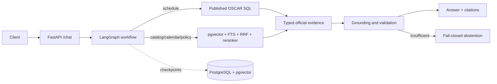

# BuzzBot Backend

BuzzBot Backend is a citation-first Agentic RAG API for Georgia Tech students. It combines
validated public OSCAR schedule data with a controlled registry of official Georgia Tech documents
and routes questions through LangGraph. It never signs into student accounts or performs
registration, add, or drop actions.

## Current capabilities

- Course offerings, sections, CRNs, instructors, meetings, and locations from published OSCAR data
- Official Catalog course descriptions, credits, and prerequisites
- Academic Calendar dates and registration deadlines
- Controlled official policy, OMSCS, admissions, finance, housing, support, and campus information
- Exact citations, freshness metadata, bounded recovery, and fail-closed abstention

## Architecture



Validated updates publish transactionally without replacing the last trusted version on failure.
The optional in-process sync loop is disabled by default; an external scheduler should invoke the
explicit ingestion commands in production so scheduling and API lifecycle remain independent.

See [architecture](docs/architecture.md), [API contract](docs/api.md), and
[frontend handoff](docs/frontend_handoff.md).

## Local development

Requirements: Python 3.11+, Docker, and an OpenAI API key for embedding or document-answer calls.

```bash
cp .env.example .env
# Add secrets to .env only.
make setup
make db-up
make migrate
make test
make test-db
make run-backend
```

The API starts at `http://localhost:8000`.

```bash
curl -s http://localhost:8000/live
curl -s http://localhost:8000/ready
curl -s http://localhost:8000/chat \
  -H 'Content-Type: application/json' \
  -d '{"query":"Is CS 7650 offered in Fall 2026?","thread_id":"portfolio-demo"}'
```

Firebase bearer verification is optional. Set `FIREBASE_AUTH_ENABLED=true` and
`FIREBASE_PROJECT_ID` in production and provide Application Default Credentials to the container or
runtime; no Firebase service-account file belongs in this repository.

## Database requirements

`DATABASE_URL` is required and is the single connection setting used by the API, Alembic,
ingestion, evaluation, and LangGraph checkpoints. PostgreSQL with the `vector` extension is
required. Schema creation is owned by Alembic; application startup does not create tables.

The value in `.env.example` is for local Docker development. A managed PostgreSQL URL can replace
it without code changes.

## Ingestion and scheduled sync

Probe a controlled document source before syncing it:

```bash
make probe-doc source=gt-catalog
make sync-doc source=gt-catalog
```

Run a bounded OSCAR subject sync:

```bash
make sync-oscar term=202608 subject=CS course=7650
```

Production schedulers can invoke the same `python -m ingestion.documents...` and
`python -m ingestion.schedule...` modules shown in [ingestion.md](docs/ingestion.md). Discovery is
allowlisted and bounded, manifests are immutable and resumable, and failed publication preserves
the previous trusted version.

## API endpoints

- `POST /chat` — typed LangGraph chat request and grounded response
- `GET /live` — dependency-free process liveness
- `GET /ready` — database, corpus, schedule freshness, and checkpoint readiness
- `GET /usage` — tracked application API cost and remaining limit
- `GET /stats` — source, document, and chunk counts
- `GET /health` — legacy-neutral liveness equivalent retained for operators

Streaming is not implemented. The current contract is one JSON response per request.

## Evaluation status

Accepted backend MVP gates:

- Schedule SQL: 150 / 150
- Schedule NLU: 150 / 150
- Schedule renderer: 140 / 140
- Course Details retrieval: 120 / 120 Hit@1 and Hit@5
- Academic Calendar route / Hit@5: 20 / 20
- Policy answer correctness: 71%
- Policy answer support: 92%
- Aggregate citation entailment: 78%
- Unsupported-confident Policy answers: 0%
- Policy production decisive Evidence Hit@5: 70%

PR12 oracle and PR13 hierarchical retrieval code under `eval/` are reproducible experiments only;
neither is a production retrieval path.

## Known limitation

> Policy decisive Evidence Hit@5 remains 70% against an 85% target. Oracle-document retrieval
> reaches 92%, while the tested hierarchical production approximation regresses to 62%. Further
> retrieval optimization is deferred until real usage data is available.

This repository is a stable MVP backend boundary, not a claim of full production readiness.

## Repository layout

```text
app/api/                    FastAPI routes and typed request/response schemas
app/graph/                  LangGraph state, workflow, understanding, persistence
app/rag/                    RAG routing, answer, retrieval orchestration, grounding
app/retrieval/              Typed schedule and official-document data access
app/db/                     SQLAlchemy models and centralized sessions
ingestion/                  Explicit document and schedule ingestion jobs
eval/                       Frozen gates and evaluation-only experiments
migrations/                 Alembic schema history
tests/                      Unit and PostgreSQL integration tests
docker-compose.yml          Local pgvector development database
Dockerfile                  Backend API image
```

## Running tests

```bash
make test
make test-db
make eval-routing
make lint
git diff --check
```

CI runs the same Ruff/unit gates, migrates an empty pgvector PostgreSQL database, and runs the
PostgreSQL integration suite. Build the non-root runtime image with `docker build -t buzzbot .`;
the image reserves writable model and usage-cache paths for the `buzzbot` user.

The smallest provider-free API/database contract check is:

```bash
docker compose up -d db
alembic upgrade head
RUN_DB_TESTS=1 pytest -q tests/integration/test_api_contract.py
```

It uses the real FastAPI and PostgreSQL paths with a stubbed workflow and test token verifier. The
web Playwright suite remains mocked and deterministic; a deployed Next.js-to-FastAPI smoke test is
still an operator step because no production Firebase credentials or model calls belong in CI.

`make quality-chat-dev` performs paid production and judge calls. Run it only intentionally under
the shared `$3` application limit; repository productization does not require it.
