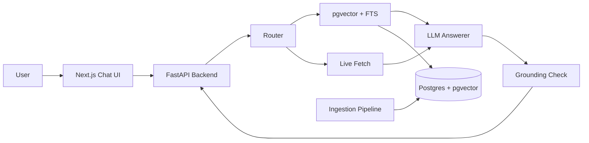

# BuzzBot 🐝

RAG-powered chatbot for Georgia Tech campus information — registration, courses, academic calendar, and more.

## Features

- **Citation-backed answers** — every response includes source URLs, fetch dates, and supporting quotes
- **Hybrid retrieval** — pgvector semantic search + PostgreSQL full-text search
- **Freshness-aware** — live fetch for time-sensitive queries (deadlines, dates), indexed for stable info
- **Multi-source ingestion** — sitemap-driven discovery, robots.txt compliance, incremental updates
- **Friendly chat UI** — Next.js with chat bubbles, sources panel, mobile responsive
- **Cost-optimized** — defaults to gpt-4o-mini; supports Anthropic and Ollama (local)
- **RMP user-provided mode** — paste a RateMyProfessors excerpt; no automated crawling

## Architecture



## Quickstart

```bash
# 1. Clone and setup
git clone <repo-url> && cd BuzzBot_repo
cp .env.example .env          # Edit with your API keys

# 2. Start database
make db-up

# 3. Run migrations
make migrate

# 4. Ingest seed data
make ingest

# 5. Start backend
make run-backend               # http://localhost:8000

# 6. Start frontend (new terminal)
make run-frontend              # http://localhost:3000
```

Or use the bootstrap script:
```bash
bash scripts/bootstrap_dev.sh
```

## Project Structure

```
app/                 # FastAPI backend (API + RAG logic)
frontend/            # Next.js chat UI
ingestion/           # Discovery → fetch → extract → chunk → index pipeline
db/                  # SQLAlchemy models + Alembic migrations
docs/                # Architecture, ingestion, API, UI docs
prompts/             # LLM prompt templates
eval/                # Evaluation questions and metrics
scripts/             # Dev bootstrap and seed scripts
tests/               # Unit tests
```

## RateMyProfessors Disclaimer

BuzzBot does **not** crawl or scrape RateMyProfessors.com. The RMP integration is **user-provided mode only**: users paste an excerpt, and BuzzBot summarizes it with an explicit "unofficial / unverified" label. This design respects RMP's Terms of Service.

## Development

```bash
make setup          # Install all dependencies
make test           # Run unit tests
make lint           # Lint with ruff
make fmt            # Auto-format
```

## Configuration

See `.env.example` for all configuration options. Key settings:

| Variable | Default | Description |
|----------|---------|-------------|
| `LLM_PROVIDER` | `openai` | `openai`, `anthropic`, or `ollama` |
| `OPENAI_MODEL` | `gpt-4o-mini` | Chat model |
| `ENABLE_LIVE_FETCH` | `true` | Fetch fresh pages for time-sensitive queries |
| `ENABLE_COMMONCRAWL` | `false` | Use Common Crawl archives |

## Docs

- [Architecture](docs/architecture.md)
- [Ingestion Pipeline](docs/ingestion.md)
- [API Reference](docs/api.md)
- [Sources Policy](docs/sources.md)
- [UI Guide](docs/ui.md)
- [Study Guide (한국어)](docs/STUDY_GUIDE_KO.md)
