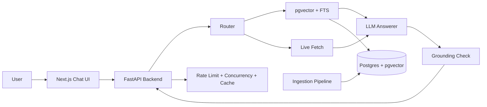

# BuzzBot 🐝

RAG-powered chatbot for Georgia Tech campus information — registration, courses, academic calendar, and more.

## Features

- **Citation-backed answers** — every response includes source URLs, fetch dates, and supporting quotes
- **Hybrid retrieval (RRF)** — pgvector semantic search + PostgreSQL full-text search + reciprocal rank fusion
- **Course-offering routing fix** — schedule/term questions (e.g., `CS 4400 Spring 2025`) route to `gt-scheduler`
- **Freshness-aware** — live fetch for time-sensitive queries (deadlines, dates), indexed for stable info
- **Query rewrite + temporal grounding** — date-sensitive queries are rewritten with current term context for better retrieval
- **Follow-up aware** — optional `history` field helps resolve references like “is it offered?”
- **Multi-source ingestion** — sitemap-driven discovery, robots.txt compliance, incremental updates
- **GT Scheduler integration** — 17 semesters (2020-2026) of course schedules with CRNs, instructors, times
- **Usage tracking & cost controls** — $20 default limit, real-time cost monitoring, automatic safety checks
- **Abuse safeguards** — per-client rate limits, duplicate cooldown, concurrency cap, and cache for repeated questions
- **Friendly chat UI** — Next.js with chat bubbles, sources panel, mobile responsive
- **Cost-optimized** — defaults to gpt-4o-mini; supports Anthropic and Ollama (local)
- **RMP user-provided mode** — paste a RateMyProfessors excerpt; no automated crawling

## Architecture



## Quickstart

```bash
# 1. Clone and setup
git clone <repo-url> && cd BuzzBot_repo
cp .env.example .env          # Edit with your OPENAI_API_KEY

# 2. Start database
make db-up

# 3. Run migrations
make migrate

# 4. Ingest all data (registrar, catalog, library, GT Scheduler courses)
make ingest-all               # ~$2-5 total cost, ~10-20 minutes
# Or run individually:
# make ingest                  # registrar + catalog (~$0.15)
# make ingest-courses-all      # GT Scheduler 17 semesters (~$1-2)

# 5. Start backend
make run-backend               # http://localhost:8000

# 6. Start frontend (new terminal)
make run-frontend              # http://localhost:3000

# 7. Monitor usage
make usage                     # Check API costs and limits
```

Or use the bootstrap script:

```bash
bash scripts/bootstrap_dev.sh
```

### Usage & Cost Safety

BuzzBot tracks all OpenAI API costs and enforces a **$20 default limit** to prevent runaway expenses:

- **Automatic tracking**: Every embedding and LLM call records token usage
- **Pre-call checks**: Raises `UsageLimitExceeded` before expensive operations
- **Per-client guardrails**: rate limit + duplicate cooldown + concurrency cap
- **Cache on repeated indexed queries**: prevents repeated identical questions from repeatedly consuming LLM/embedding cost
- **API endpoints**:
  - `GET /usage` — current spending and limit
  - `POST /usage/reset` — reset counters to $0
  - `POST /usage/set-limit?limit=50.0` — change the limit
- **Makefile commands**:
  - `make usage` — view current costs
  - `make usage-reset` — reset to $0

Typical costs:

- Initial ingestion (all sources): **$2-5**
- Per chat query: **~$0.001-0.003** (embeddings + LLM call)
- Full re-ingestion: **~$2-5**

Guardrails still work even if you increase `USAGE_LIMIT`.

## Project Structure

```
app/                 # FastAPI backend (API + RAG logic)
  core/              # Configuration and usage tracking
  rag/               # Router, retrieval, answerer, grounding check
  api/               # Chat and health endpoints
  schemas/           # Pydantic models
frontend/            # Next.js chat UI
ingestion/           # Discovery → fetch → extract → chunk → index pipeline
  gt_scheduler.py    # GT Scheduler course data ingestion
  commoncrawl/       # Common Crawl WARC archive support
db/                  # SQLAlchemy models + Alembic migrations
docs/                # Architecture, ingestion, API, UI docs
prompts/             # LLM prompt templates (conversational tone)
schemas/             # JSON schemas for structured outputs
eval/                # Evaluation questions and metrics
scripts/             # Dev bootstrap and seed scripts
tests/               # Unit tests
```

## Data Sources

BuzzBot ingests data from multiple Georgia Tech official sources:

| Source           | URLs         | Content                                            | Ingestion Command         |
| ---------------- | ------------ | -------------------------------------------------- | ------------------------- |
| **Registrar**    | ~500         | Academic calendar, registration dates, policies    | `make ingest`             |
| **Catalog**      | ~1000        | Course descriptions, degree requirements           | `make ingest`             |
| **Library**      | ~1000        | Library services, hours, policies                  | `make ingest`             |
| **GT Scheduler** | 17 semesters | Course schedules (CRNs, times, instructors, rooms) | `make ingest-courses-all` |

**GT Scheduler Integration**: Fetches JSON data from [gt-scheduler.github.io/crawler-v2](https://gt-scheduler.github.io/crawler-v2/) covering Fall 2020 through Spring 2026. Each course and section gets indexed with:

- Course codes (e.g., CS 1301, MATH 1554)
- Instructors, CRNs, meeting times, locations
- Credit hours, prerequisites, descriptions

Run `make ingest-all` to fetch everything at once (~$2-5, 10-20 minutes).

## RateMyProfessors Disclaimer

BuzzBot does **not** crawl or scrape RateMyProfessors.com. The RMP integration is **user-provided mode only**: users paste an excerpt, and BuzzBot summarizes it with an explicit "unofficial / unverified" label. This design respects RMP's Terms of Service.

## Development

```bash
make setup          # Install all dependencies
make test           # Run unit tests
make lint           # Lint with ruff
make fmt            # Auto-format
python3 eval/retrieval_regression.py   # Routing/retrieval regression checks
python3 eval/retrieval_perf.py         # Retrieval latency benchmark
python3 eval/pipeline_phase1_eval.py   # Baseline vs improved (query rewrite/date-context) comparison
```

## Configuration

See `.env.example` for all configuration options. Key settings:

| Variable             | Default       | Description                                   |
| -------------------- | ------------- | --------------------------------------------- |
| `LLM_PROVIDER`       | `openai`      | `openai`, `anthropic`, or `ollama`            |
| `OPENAI_MODEL`       | `gpt-4o-mini` | Chat model (conversational tone)              |
| `USAGE_LIMIT`        | `20.0`        | Maximum API cost in USD before blocking calls |
| `ENABLE_LIVE_FETCH`  | `true`        | Fetch fresh pages for time-sensitive queries  |
| `RAG_ENABLE_QUERY_REWRITE` | `true` | Enable retrieval query rewrite step |
| `RAG_QUERY_REWRITE_MODE` | `rule` | Rewrite mode: `rule`, `llm`, `auto` |
| `RAG_FORCE_FTS_FOR_DATE_SENSITIVE` | `true` | Always run FTS with vector for date-sensitive queries |
| `RAG_SKIP_FTS_WHEN_VECTOR_SUFFICIENT` | `false` | Keep lexical fallback on by default |
| `CHAT_RATE_LIMIT_PER_MINUTE` | `24` | Per-client minute-level request cap |
| `CHAT_RATE_LIMIT_PER_HOUR` | `240` | Per-client hour-level request cap |
| `CHAT_RATE_LIMIT_PER_DAY` | `400` | Per-client daily request cap |
| `CHAT_MAX_CONCURRENCY` | `12` | Max concurrent expensive chat executions |
| `RAG_ENABLE_EMBEDDING_CACHE` | `true` | Cache query embeddings to reduce latency/cost |
| `RAG_RESPONSE_CACHE_TTL_SECONDS` | `180` | Cache TTL for repeated indexed chat responses |
| `ENABLE_COMMONCRAWL` | `false`       | Use Common Crawl archives                     |

## Retrieval Quality Notes

- Exact schedule queries now use metadata-aware filtering on `course_code` and `term_name`.
- FTS query terms are compacted to high-signal tokens to reduce DB scan overhead.
- Exact schedule lookups can skip FTS when vector+metadata already returns enough hits.
- Default now keeps FTS enabled even when vector results are sufficient (`RAG_SKIP_FTS_WHEN_VECTOR_SUFFICIENT=false`) to preserve exact-keyword hits.
- Date-sensitive queries can force vector+FTS together (`RAG_FORCE_FTS_FOR_DATE_SENSITIVE=true`).
- Live fetch chunks are reranked with embedding similarity (not token overlap only).
- Grounding now drops empty-quote citations and URL-mismatched citations.

## Phase-1 Improvement Metrics (2026-02-17)

Measured with:
- `python3 eval/retrieval_regression.py`
- `RAG_QUERY_REWRITE_MODE=rule python3 eval/pipeline_phase1_eval.py`

Results:

| Metric | Before | After | Delta |
| --- | ---: | ---: | ---: |
| Retrieval regression strict_match (`eval/retrieval_regression.py`) | 0.875 | 0.875 | 0.000 |
| Coverage@5 on ambiguity/date/follow-up set (`eval/pipeline_phase1_eval.py`) | 0.600 | 0.800 | +0.200 |
| Source hit@5 on same set | 1.000 | 1.000 | 0.000 |

Notes:
- Biggest gain came from follow-up resolution (`\"Is it offered in Spring 2025?\"` + history -> `CS 4400`).
- Mixed query routing now supports multi-source retrieval for registrar+course queries.
- Ingestion-side changes (heading/table/summary chunks) require re-ingestion to affect production answers.

## References

- Lewis et al., "Retrieval-Augmented Generation for Knowledge-Intensive NLP Tasks" (NeurIPS 2020). https://arxiv.org/abs/2005.11401
- Cormack, Clarke, Buettcher, "Reciprocal Rank Fusion Outperforms Condorcet and Individual Rank Learning Methods" (SIGIR 2009). https://doi.org/10.1145/1571941.1572114
- PostgreSQL Full Text Search docs (official). https://www.postgresql.org/docs/current/textsearch.html
- pgvector (official repository/docs). https://github.com/pgvector/pgvector

## Docs

- [Architecture](docs/architecture.md)
- [Ingestion Pipeline](docs/ingestion.md)
- [API Reference](docs/api.md)
- [Sources Policy](docs/sources.md)
- [UI Guide](docs/ui.md)
- [Study Guide (한국어)](docs/STUDY_GUIDE_KO.md)
