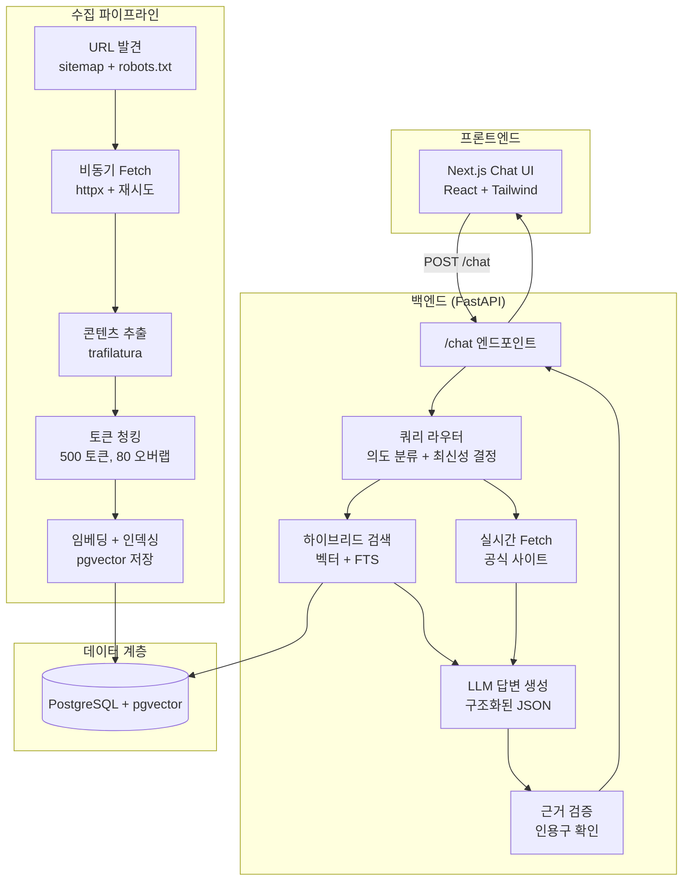
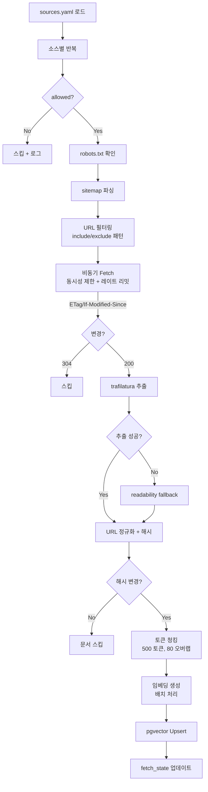
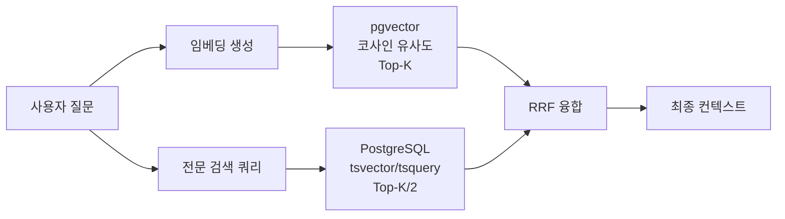

# BuzzBot 스터디 가이드 (인터뷰 대비) 🐝

> Georgia Tech 캠퍼스 정보 RAG 챗봇 — 설계부터 구현까지 깊이 있는 분석

---

## 목차

1. [프로젝트 개요 및 문제 정의](#1-프로젝트-개요-및-문제-정의)
2. [전체 아키텍처](#2-전체-아키텍처)
3. [Tech Stack 선택 이유](#3-tech-stack-선택-이유)
4. [데이터 수집 전략](#4-데이터-수집-전략)
5. [RAG 품질 설계](#5-rag-품질-설계)
6. [최신성 보장 전략](#6-최신성-보장-전략)
7. [비용 최적화](#7-비용-최적화)
8. [RMP 정책 설계](#8-rmp-정책-설계)
9. [인터뷰 Q&A](#9-인터뷰-qa)
10. [향후 개선 로드맵](#10-향후-개선-로드맵)

---

## 1. 프로젝트 개요 및 문제 정의

### 해결하려는 문제

Georgia Tech 학생들은 수강신청 마감일, 강의 정보, 학사 일정 등을 여러 공식 웹사이트에서 각각 찾아야 한다. 정보가 분산되어 있고, 특히 시간에 민감한 마감일 정보는 실시간으로 확인해야 한다.

### BuzzBot의 해결 방식

- **RAG (Retrieval-Augmented Generation)**: 공식 소스에서 수집한 데이터를 벡터 DB에 저장하고, 사용자 질문에 관련 정보를 검색한 후 LLM이 인용 포함 답변을 생성
- **인용 기반 답변**: 모든 답변에 출처 URL, 수집 일자, 원문 인용구 포함
- **최신성 보장**: 시간에 민감한 질문에는 실시간 fetch 수행

### 핵심 설계 원칙

1. **정확성 우선**: 인용 없는 답변 금지, 근거 검증 (grounding check)
2. **비용 효율**: 저가 모델(gpt-4o-mini) 기본 사용
3. **법적/윤리적 준수**: robots.txt 존중, RMP 크롤링 금지
4. **증분 업데이트**: 변경된 콘텐츠만 재처리

---

## 2. 전체 아키텍처

### 시스템 구성도



### 컴포넌트별 책임

| 컴포넌트 | 책임 | 핵심 기술 |
|---------|------|----------|
| **쿼리 라우터** | 의도 분류, 최신성 전략 결정, 소스 필터링 | 규칙 기반 키워드 매칭 |
| **하이브리드 검색** | 의미적 + 키워드 기반 문서 검색 | pgvector cosine + PostgreSQL tsvector |
| **실시간 Fetch** | 시간 민감 쿼리에 대한 최신 페이지 수집 | httpx async, robots.txt 준수 |
| **LLM 답변기** | 컨텍스트 기반 JSON 답변 생성 | OpenAI / Anthropic / Ollama |
| **근거 검증** | 인용구가 실제 검색된 청크에 존재하는지 확인 | 부분 문자열 + 단어 오버랩 검사 |
| **수집 파이프라인** | 정기적 데이터 수집/갱신 | sitemap, httpx, trafilatura, tiktoken |

### 데이터 모델 (ER 다이어그램)

```mermaid
erDiagram
    SOURCES ||--o{ DOCUMENTS : "has many"
    DOCUMENTS ||--o{ CHUNKS : "has many"
    CHUNKS ||--o| EMBEDDINGS : "has one"
    SOURCES {
        uuid id PK
        string name UK
        string base_url
        boolean allowed
        string reason
        json refresh_policy_json
    }
    DOCUMENTS {
        uuid doc_id PK
        uuid source_id FK
        string canonical_url UK
        string title
        text content_text
        string content_hash
        datetime fetched_at
    }
    CHUNKS {
        uuid chunk_id PK
        uuid doc_id FK
        uuid source_id
        text chunk_text
        string chunk_hash
        int token_count
    }
    EMBEDDINGS {
        uuid chunk_id PK_FK
        vector embedding "1536차원"
    }
    FETCH_STATE {
        string url PK
        uuid source_id
        string etag
        string last_modified
        string content_hash
        string status
    }
```

---

## 3. Tech Stack 선택 이유

### 백엔드: FastAPI

**선택 이유:**
- **비동기 네이티브**: `async/await` 지원으로 I/O 바운드 작업(LLM API, DB 쿼리, HTTP fetch)에 최적
- **자동 API 문서**: OpenAPI/Swagger 자동 생성
- **Pydantic 통합**: 요청/응답 검증 자동화
- **높은 성능**: Starlette 기반, Node.js급 처리량

**대안 비교:**
| 프레임워크 | 장점 | 단점 |
|-----------|------|------|
| Flask | 간단, 성숙한 에코시스템 | 비동기 미지원, 수동 검증 |
| Django | 배터리 포함, ORM 내장 | 무거움, 비동기 아직 실험적 |
| Express.js | Node 생태계 | Python ML 라이브러리 사용 어려움 |

### 데이터베이스: PostgreSQL + pgvector

**선택 이유:**
- **하나의 DB로 통합**: 벡터 검색 + 관계형 데이터 + 전문 검색(FTS) 모두 가능
- **pgvector**: 벡터 유사도 검색을 SQL로 수행, 별도 벡터 DB 불필요
- **전문 검색**: `tsvector/tsquery`로 키워드 기반 fallback 검색 가능
- **안정성**: 수십 년간 검증된 RDBMS

**대안 비교:**
| 솔루션 | 장점 | 단점 |
|--------|------|------|
| Pinecone | 관리형 벡터 DB | 비용, 벤더 종속, 관계형 데이터 별도 필요 |
| Weaviate | 벡터 + 객체 저장 | 자체 운영 필요, 러닝 커브 |
| ChromaDB | 간단, 임베디드 | 프로덕션 확장성 부족 |
| Elasticsearch | 강력한 FTS | 벡터 검색 성능 pgvector 대비 떨어짐 |

### 콘텐츠 추출: trafilatura

**선택 이유:**
- HTML에서 **메인 콘텐츠만** 정확히 추출 (네비게이션, 광고, 푸터 제거)
- 언어 감지, 메타데이터 추출 내장
- 학술/기관 웹사이트에 특히 강력한 성능

**Fallback: readability-lxml** — trafilatura 실패 시 대비

### LLM: gpt-4o-mini (기본)

**선택 이유:**
- **비용**: GPT-4 대비 ~60x 저렴
- **속도**: 낮은 지연시간
- **품질**: 지시사항 따르기(JSON 출력, 인용 포함) 우수
- **교체 가능**: 환경변수로 Anthropic/Ollama 전환

### 프론트엔드: Next.js + Tailwind

**선택 이유:**
- **App Router**: 서버 컴포넌트, 레이아웃 시스템으로 성능 최적화
- **Tailwind**: 유틸리티 CSS로 빠른 반응형 UI 구현
- **React 생태계**: 풍부한 컴포넌트/라이브러리

---

## 4. 데이터 수집 전략

### 수집 파이프라인 상세



### robots.txt 준수

모든 URL은 fetch 전에 `urllib.robotparser`로 확인. BuzzBot의 User-Agent는 `BuzzBot/1.0`으로 설정되며, 규칙에 따라 접근이 차단된 경로는 자동 스킵.

### Sitemap 우선 전략

1. `sitemap.xml` 또는 `sitemap_index.xml`에서 URL 목록 가져오기
2. sitemap이 없으면 `base_url`만 수집
3. 재귀적 sitemap index 지원

### 증분 업데이트 (Incremental)

- **HTTP 조건부 요청**: ETag와 Last-Modified 헤더 활용
- **콘텐츠 해시**: SHA-256으로 텍스트 변경 감지
- **결과**: 변경되지 않은 페이지는 fetch도, 인덱싱도 스킵 → 비용/시간 절약

### 실패 처리 및 재시도

- **지수 백오프**: 실패 시 2초 → 4초 → 15초 대기 후 재시도 (최대 3회)
- **per-URL 에러 추적**: `fetch_state` 테이블에 status와 error 기록
- **아티팩트**: `artifacts/failed_urls.json`에 실패 URL 목록 기록

### 레이트 리밋 & 동시성 제어

- **도메인별 레이트 리밋**: 기본 2 req/s (`INGEST_RATE_LIMIT_PER_DOMAIN`)
- **동시성 제한**: 기본 5개 동시 요청 (`INGEST_CONCURRENCY`)
- **목적**: 대상 서버에 부담을 주지 않는 "polite" 수집

---

## 5. RAG 품질 설계

### 청킹 (Chunking) 전략

| 파라미터 | 값 | 근거 |
|---------|---|------|
| chunk_size | 500 토큰 | 충분한 문맥을 포함하면서도 검색 정밀도 유지 |
| chunk_overlap | 80 토큰 | 청크 경계에서 문맥 손실 방지 |
| min_chunk_size | 50 토큰 | 의미 없는 짧은 청크 필터링 |

**토큰 카운팅**: tiktoken (`cl100k_base` 인코딩) 사용. 미설치 시 단어 수 기반 fallback.

### 메타데이터 풍부화

각 청크에는 다음 메타데이터가 포함:
- `url`: 원본 페이지 URL
- `title`: 페이지 제목
- `headings`: 추출된 제목 목록
- `source`: 소스 이름 (e.g., `gt-registrar`)
- `fetched_at`: 수집 시점

이 메타데이터는 검색 시 **소스 필터링**과 응답 시 **인용 생성**에 활용.

### 하이브리드 검색 (Hybrid Retrieval)



**왜 하이브리드인가?**
- **벡터 검색만**: 의미적으로 유사하지만 정확한 키워드가 없으면 놓칠 수 있음
- **FTS만**: 키워드 매칭에 강하지만 동의어/의미적 유사성 처리 불가
- **하이브리드**: 두 방법의 장점을 결합, 특히 과목 코드(CS 1332)나 고유명사에 강력

### 최근 개선점 (정확도 + 속도)

1. **라우팅 보강**: `CS4400`, `Spring 2025`, `offered/개설` 패턴은 `gt-scheduler`로 우선 라우팅  
2. **메타데이터 필터**: 스케줄 질의에서 `course_code`, `term_name`을 JSON metadata 조건으로 직접 필터  
3. **RRF 융합**: 벡터/FTS 결과를 단순 concat 대신 Reciprocal Rank Fusion으로 결합  
4. **FTS 최적화**: 고신호 토큰만 남기고 `websearch_to_tsquery('simple', ...)` 사용  
5. **DB 인덱스 최적화**:
   - `embeddings.embedding` IVFFlat(cosine) 인덱스
   - `to_tsvector('simple', chunk_text)` GIN 인덱스
   - `(source_id, upper(course_code), lower(term_name))` 표현식 인덱스
6. **Exact schedule fast-path**: course+term이 모두 있으면 벡터+메타데이터 결과가 충분할 때 FTS 생략
7. **Query rewrite 연결**: 검색 전 query rewrite 단계 추가 (raw query 직접 임베딩 제거)
8. **현재 날짜/학기 주입**: date-sensitive 질문에서 `CURRENT_DATE`, `CURRENT_TERM` 기반 질의 보강
9. **date-sensitive FTS 강제 병행**: 벡터 결과가 충분해도 날짜 질문은 FTS를 같이 수행
10. **Follow-up 문맥 처리**: `history` 기반으로 `it` 같은 지시어를 standalone query로 복원
11. **Live fetch 재정렬 개선**: 단순 token overlap 대신 임베딩 기반 재랭킹으로 노이즈 감소
12. **혼합 질의 다중 소스 검색**: registrar + course code 혼합 질의 시 `gt-registrar/gt-scheduler/gt-catalog` 동시 검색

### Phase 1 메트릭 결과 (2026-02-17)

실행 커맨드:
- `python3 eval/retrieval_regression.py`
- `RAG_QUERY_REWRITE_MODE=rule python3 eval/pipeline_phase1_eval.py`

결과 요약:

| Metric | Before | After | Delta |
|------|-------:|------:|------:|
| Retrieval regression strict_match | 0.875 | 0.875 | 0.000 |
| Coverage@5 (ambiguity/date/follow-up set) | 0.600 | 0.800 | +0.200 |
| Source hit@5 (same set) | 1.000 | 1.000 | 0.000 |

해석:
- 회귀 테스트는 성능 저하 없이 유지됨.
- 모호한 질문/후속 질문 세트에서 top-5 정답 포함률이 상승.
- 특히 `\"Is it offered in Spring 2025?\"` 유형에서 history 기반 복원이 효과적.

### 근거 검증 (Grounding Check)

1. 각 인용구(quote)가 검색된 청크 텍스트의 **부분 문자열**인지 확인
2. 정확한 부분 문자열이 아니면 **단어 오버랩 비율** 계산 (50% 이상 필요)
3. **빈 quote 인용은 제거**
4. **인용 URL이 실제 검색 컨텍스트 URL에 없으면 제거**
5. 검증 실패한 인용구는 제거
6. 필요 시에만(설정값) 1회 재생성 시도

---

## 6. 최신성 보장 전략

### 문제

학사 일정, 수강신청 마감일 등은 시간에 매우 민감. 사전 수집 데이터가 오래되면 잘못된 답변 제공 위험.

### 해결: 3가지 전략

| 전략 | 설명 | 사용 시점 |
|------|------|----------|
| `indexed` | 사전 수집된 데이터만 사용 | 안정적 정보 (강의 설명, 학위 요건) |
| `live_fetch` | 공식 사이트 실시간 fetch | 마감일, 날짜 질문 |
| `hybrid` | indexed + live_fetch 병합 | 시간 키워드가 포함된 일반 질문 |

### Live Fetch 작동 방식

1. 라우터가 `freshness_strategy: live_fetch` 결정
2. 의도에 맞는 공식 URL 목록 (최대 3개)에서 실시간 fetch
3. trafilatura로 추출 → 청킹 → 임시 컨텍스트로 추가
4. 실시간 fetch 결과를 임베딩 유사도로 재정렬 후 상위 청크만 사용

### 트레이드오프

| 측면 | Live Fetch | Scheduled Ingestion |
|------|-----------|-------------------|
| 최신성 | 실시간 | 최대 24시간 지연 |
| 지연시간 | +2-5초 | 즉시 |
| 서버 부담 | 요청마다 fetch | 배치 처리 |
| 안정성 | 대상 서버 다운 시 실패 | 캐시된 데이터 사용 가능 |

**BuzzBot의 접근**: live fetch를 **최소한으로** (1-3 URL) 제한하고, polite User-Agent 사용, 실패 시 indexed fallback.

---

## 7. 비용 최적화

### LLM 비용 제어

1. **저가 모델 기본값**: `gpt-4o-mini` ($0.15/1M input, $0.60/1M output) — GPT-4 대비 ~60x 저렴
2. **컨텍스트 제한**: `RAG_MAX_CONTEXT_TOKENS=3000` — 불필요하게 긴 컨텍스트 방지
3. **Top-K 제한**: `RAG_TOP_K=8` — 검색 결과 수 제한
4. **JSON 응답 강제**: 불필요한 텍스트 생성 방지
5. **검색 결과 0건이면 LLM 호출 생략**: 헛비용/환각 감소

### 임베딩 비용 제어

1. **변경 감지**: content_hash로 변경된 문서만 재임베딩
2. **배치 처리**: 32개 청크씩 배치 임베딩 요청
3. **로컬 옵션**: `sentence-transformers` (CPU)로 무료 임베딩 가능
4. **질의 임베딩 캐시**: 동일 질문 반복 시 임베딩 API 재호출 방지

### 악성 트래픽 방어 (Usage Limit 추가 방어층)

`USAGE_LIMIT`과 별개로 다음 방어를 적용:

1. **클라이언트별 슬라이딩 윈도우 제한**: 분/시간/일 요청 상한
2. **중복 질문 쿨다운**: 동일 질의 연속 호출 차단
3. **동시성 상한**: 비싼 chat 파이프라인 동시 실행 수 제한
4. **응답 캐시**: 동일 indexed 질의는 캐시 반환

이 구조는 `USAGE_LIMIT`을 올려도 동작하므로, 반복 호출 기반 비용 증폭을 추가로 완화함.

### 수집 비용 제어

1. **조건부 HTTP**: ETag/If-Modified-Since로 변경 없는 페이지 스킵
2. **URL 캡**: 소스당 최대 URL 수 제한
3. **증분 업데이트**: 전체 재수집 대신 변경분만 처리

### 비용 추정 (월간)

| 항목 | 예상 비용 |
|------|----------|
| OpenAI 임베딩 (초기 수집 ~500 페이지) | ~$0.05 |
| OpenAI 임베딩 (일일 증분 ~50 페이지) | ~$0.01/일 |
| LLM 답변 생성 (~1000 쿼리/일) | ~$3-5/일 |
| PostgreSQL (Docker) | 무료 (self-hosted) |
| **총 월간** | **~$100-150** |

---

## 8. RMP 정책 설계

### 왜 User-Provided Mode만?

#### 법적 이유
- RateMyProfessors.com의 **이용약관(ToS)**이 자동화된 접근(크롤링, 스크래핑, 스파이더링)을 **명시적으로 금지**
- 위반 시 법적 조치 가능 (Computer Fraud and Abuse Act 등)

#### 윤리적 이유
- 교수 리뷰는 **개인에 관한 민감한 정보**
- 자동 수집 + 요약 시 맥락 왜곡 위험
- 학생이 직접 제공한 정보에 한정하면 **사용자가 데이터 흐름 통제**

#### 기술적 안전 설계
1. `sources.yaml`에서 `allowed: false` + 이유 명시
2. Common Crawl 도메인 blocklist에 `ratemyprofessors.com` 포함
3. 수집 파이프라인이 RMP URL 자동 차단
4. API 응답에 "user-provided, unofficial, unverified" 라벨 강제

### User-Provided 모드 작동 방식

1. 사용자가 `rmp_excerpt` 필드에 텍스트 붙여넣기
2. 시스템이 해당 텍스트를 컨텍스트에 추가 (별도 소스 라벨)
3. LLM이 주제/장단점/감정 요약
4. 인용은 `user-provided:rmp`로 표기
5. 모든 RMP 관련 응답에 비공식/미검증 면책 표시

---

## 9. 인터뷰 Q&A

### Q1: "왜 별도 벡터 DB 대신 pgvector를 선택했나요?"

**A:** 운영 복잡도를 낮추기 위해서입니다. Pinecone이나 Weaviate를 쓰면 벡터 검색용 DB와 관계형 데이터용 DB를 따로 운영해야 합니다. pgvector를 쓰면:
- PostgreSQL 하나로 벡터 검색, 관계형 데이터, 전문 검색 모두 처리
- 트랜잭션 일관성 보장 (청크와 임베딩이 항상 동기화)
- 인프라 비용 절감 (DB 하나만 운영)
- 데이터 규모가 수백만 벡터를 넘기 전까지는 성능 충분

### Q2: "RAG에서 hallucination을 어떻게 줄이나요?"

**A:** 다층 방어:
1. **검색 품질**: 하이브리드 검색으로 관련 없는 청크 유입 최소화
2. **프롬프트 설계**: "컨텍스트에 없으면 모른다고 말해라" 지시
3. **JSON 강제**: 구조화된 출력으로 자유 생성 제한
4. **근거 검증**: 인용구가 실제 청크/URL에 있는지 자동 검사
5. **신뢰도 점수**: 낮으면 "공식 사이트 확인" 권장
6. **빈 검색 단락 처리**: 컨텍스트가 없으면 LLM 호출 자체를 생략

### Q3: "청킹 크기 500 토큰의 근거는?"

**A:** 경험적 균형:
- **너무 작으면** (100-200): 문맥 부족, 검색 노이즈 증가
- **너무 크면** (1000+): 검색 정밀도 저하, LLM 컨텍스트 낭비
- **500 토큰**: 한 문단~한 섹션 정도로, 의미 단위를 유지하면서 검색에 적합
- **80 토큰 오버랩**: 청크 경계에서 문장이 잘리는 문제 방지 (약 1-2 문장 겹침)

### Q4: "실시간 fetch가 실패하면?"

**A:**
1. 개별 URL 실패: 해당 URL 스킵, 다른 URL 결과 사용
2. 모든 live fetch 실패: `indexed` 결과로 fallback
3. 응답의 `freshness.strategy` 필드에 실제 사용된 전략 표시
4. `notes`에 "최신 데이터 확인 불가, 사전 수집 데이터 기반" 경고 추가

### Q5: "왜 FastAPI + Python인가? Node.js가 더 빠르지 않은가?"

**A:** 성능이 아니라 **생태계 적합성**이 핵심:
- ML/AI 라이브러리 (openai, anthropic, sentence-transformers, tiktoken) 모두 Python 네이티브
- trafilatura (콘텐츠 추출)도 Python
- FastAPI는 `async/await`로 I/O 성능은 Node.js에 준하면서 Python 생태계 활용 가능
- 이 프로젝트에서 병목은 LLM API 호출 (수백ms~수초) 이지, 서버 프레임워크가 아님

### Q6: "Common Crawl 모듈의 목적은?"

**A:** 초기 데이터 부트스트래핑:
- 실시간 크롤링으로 수백 페이지를 수집하면 대상 서버에 부담
- Common Crawl 아카이브에서 과거 캐시된 데이터를 가져오면 대상 서버 접근 없이 초기 데이터 확보
- 이후 증분 업데이트로 최신화
- gatech.edu 도메인만 허용, RMP 도메인 명시적 차단

### Q7: "대규모로 확장하려면 어떻게 하겠는가?"

**A:**
1. **DB**: pgvector → 전용 벡터 DB (Pinecone, Qdrant) + PostgreSQL 분리
2. **캐싱**: Redis로 자주 묻는 질문의 임베딩/답변 캐시
3. **비동기 큐**: Celery/Redis로 수집 작업 큐잉
4. **API**: 여러 인스턴스 + 로드밸런서
5. **임베딩**: GPU 서버에서 배치 처리
6. **모니터링**: Prometheus + Grafana로 지연시간, 에러율, 검색 품질 추적

### Q8: "테스트 전략은?"

**A:**
- **단위 테스트**: URL 정규화, 청킹 경계, 근거 검증, 라우터 규칙
- **통합 테스트**: API 엔드포인트 (TestClient + 모의 DB)
- **RAG 평가**:
  - `eval/retrieval_regression.py`로 라우팅/검색 회귀 테스트
  - `eval/retrieval_perf.py`로 검색 지연시간 측정
- **CI**: GitHub Actions로 lint + test 자동화

### Q9: "이 프로젝트에서 가장 어려웠던 기술적 도전은?"

**A:** (인터뷰 시 개인 경험으로 답변)
대표적 도전:
1. **청킹 품질**: HTML → 깨끗한 텍스트 → 의미 단위 청크 파이프라인 정교화
2. **최신성과 비용의 균형**: 모든 쿼리에 live fetch하면 비용/지연 증가 → 라우터로 선별
3. **근거 검증**: LLM이 인용구를 약간 변형/요약하는 경향 → 엄격한 부분 문자열 + 유연한 단어 오버랩 이중 검사

### Q10: "보안 고려사항은?"

**A:**
- **API 키**: `.env`에만 저장, 코드에 하드코딩 금지
- **CORS**: 프론트엔드 origin만 허용
- **입력 검증**: Pydantic으로 모든 요청 검증 (길이 제한 포함)
- **SQL 인젝션**: SQLAlchemy ORM 사용으로 방어
- **요청 ID**: 구조화된 로그로 추적 가능
- **요청 Guardrail**: per-client rate limit + duplicate cooldown + concurrency cap
- **robots.txt**: 크롤링 규칙 준수

---

## 10. 향후 개선 로드맵

### 단기 (1-2개월)
- [ ] 스트리밍 응답 (SSE) 적용 — 사용자 체감 지연 감소
- [ ] 대화 히스토리 지원 — 다중 턴 대화
- [ ] 분산 캐시 (Redis) — 멀티 인스턴스 환경에서 캐시 공유
- [ ] 소스별 신뢰도 가중치 — 공식 소스 우선

### 중기 (3-6개월)
- [ ] 사용자 인증 + 개인화 — 전공/학기별 맞춤 답변
- [ ] 다국어 지원 — 한국어, 중국어 등 국제 학생 지원
- [ ] 모바일 앱 (React Native 또는 PWA)
- [ ] A/B 테스트 프레임워크 — 프롬프트/검색 전략 비교
- [ ] 피드백 수집 — 답변 품질 평가 (thumbs up/down)

### 장기 (6개월+)
- [ ] 지식 그래프 통합 — 과목 간 관계, 선수과목 추론
- [ ] 에이전트 기반 확장 — 수강신청 보조, 일정 추천
- [ ] 학교 공식 채널 연동 — 이메일 알림, 캘린더 동기화
- [ ] 멀티모달 — 캠퍼스 지도, 건물 사진 포함 답변
- [ ] 파인튜닝 — GT 도메인 특화 소형 모델로 비용 추가 절감

---

> 이 문서는 BuzzBot 프로젝트의 설계 의도와 기술적 결정을 면접 관점에서 정리한 것입니다.
> 실제 면접에서는 자신의 경험과 연결하여 답변하세요.

---

## 참고 자료 (추후 학습용)

1. Patrick Lewis et al. (2020), **Retrieval-Augmented Generation for Knowledge-Intensive NLP Tasks** (NeurIPS). https://arxiv.org/abs/2005.11401  
2. Gordon V. Cormack, Charles L. A. Clarke, Stefan Buettcher (2009), **Reciprocal Rank Fusion Outperforms Condorcet and Individual Rank Learning Methods** (SIGIR). https://doi.org/10.1145/1571941.1572114  
3. PostgreSQL 공식 문서, **Text Search**. https://www.postgresql.org/docs/current/textsearch.html  
4. pgvector 공식 저장소/문서. https://github.com/pgvector/pgvector
