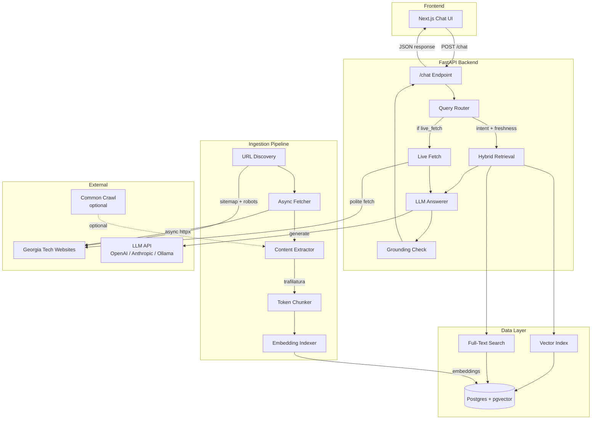
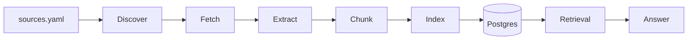

# BuzzBot Architecture

## Overview

BuzzBot is a Retrieval-Augmented Generation (RAG) chatbot serving Georgia Tech campus information. It combines offline ingestion, real-time retrieval, and LLM generation with citation grounding.

## System Diagram

## Request Flow

1. **User sends query** via Next.js UI → `POST /chat`
2. **Router** classifies intent (`registrar_calendar`, `catalog_course`, `general`, `rmp_user_provided`) and decides freshness strategy (`indexed`, `live_fetch`, `hybrid`)
3. **Retrieval** performs hybrid search:
   - **Vector search**: pgvector cosine similarity on chunk embeddings
   - **FTS fallback**: PostgreSQL `tsvector` full-text search
4. **Live Fetch** (if freshness requires): politely fetches 1-3 official GT pages, extracts and chunks on the fly
5. **Answerer**: sends retrieved context + query to LLM, receives structured JSON answer with citations
6. **Grounding Check**: verifies each citation quote is a substring (or high word-overlap) of a retrieved chunk
7. **Response**: returns JSON with answer, citations, confidence, freshness info, and debug metadata

## Data Plane

### Tables

| Table | Purpose |
|-------|---------|
| `sources` | Registered data sources with policy gates |
| `documents` | Fetched pages with content hash for dedup |
| `chunks` | Token-sized text chunks with metadata |
| `embeddings` | Vector embeddings (pgvector, 1536-dim) |
| `fetch_state` | Per-URL fetch state for conditional requests |

## Failure Modes

| Component | Failure | Mitigation |
|-----------|---------|------------|
| LLM API | Timeout / rate limit | Retry with backoff; fallback message |
| Live fetch | Target unreachable | Fall back to indexed results |
| Ingestion | Partial failure | Per-URL error tracking; artifacts log |
| Grounding | All citations invalid | One regeneration attempt; low confidence warning |
| Database | Connection loss | Connection pool with health checks |

## Interfaces

- **Frontend ↔ Backend**: REST JSON (`POST /chat`, `GET /health`, `GET /stats`)
- **Backend ↔ LLM**: Provider-specific SDK (OpenAI, Anthropic, Ollama HTTP)
- **Backend ↔ DB**: SQLAlchemy async + pgvector extension
- **Ingestion ↔ Web**: httpx async with robots.txt/sitemap compliance
