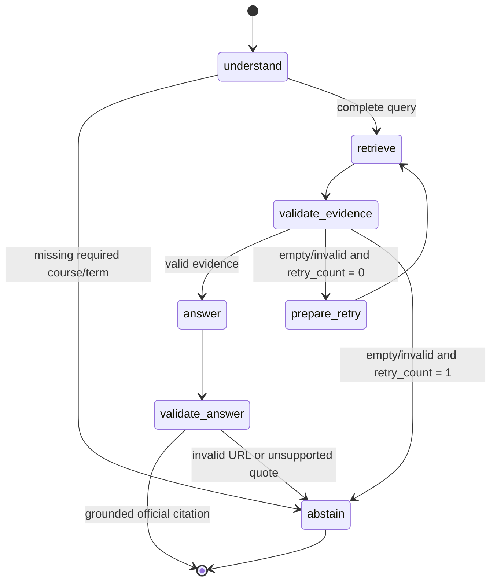
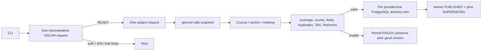
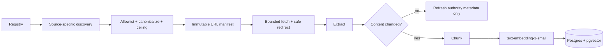

# BuzzBot Backend Architecture

## Design goal

BuzzBot is a controlled Agentic RAG system for public Georgia Tech facts. “Agentic” means the
workflow can choose a typed retrieval tool, validate its evidence, make one bounded recovery attempt,
and abstain. It does not mean an unconstrained LLM loop.

## Runtime graph

The state is a small `TypedDict`: query, normalized intent/fields, retry count, compact evidence,
answer, citations, and notes. SQLAlchemy sessions and model clients are dependencies, not checkpointed
state.

## Tool routing

| Intent | Required fields | Tool | Authority |
|---|---|---|---|
| Course schedule | term code, subject, course number | `lookup_course_offerings` | latest published OSCAR version |
| Course details | subject, course number | `lookup_course_details` | official Catalog only |
| Registration calendar | question text | `lookup_registration_calendar` | official Academic Calendar only |
| Policy/admissions | question text | `search_policy_docs` | controlled official registry |

Schedule answers are formatted deterministically and do not require an LLM. Document answers use the
configured cheap model after evidence retrieval. Every OpenAI path passes through the tracked `$3`
usage guard.

## Schedule ingestion and publication

Publication uses explicit version-scoped foreign keys and a deterministic per-unit PostgreSQL
advisory transaction lock. Concurrent publication for the same unit cannot leave two current
versions; different units are not globally serialized.

## Official document ingestion

The registry has exact HTTPS roots, seed URLs, source type, authority, accepted content types, and a
source-specific URL safety ceiling. Discovery adapters allowlist, canonicalize, and deduplicate URLs
before storing an immutable run manifest. Exceeding a ceiling fails planning rather than truncating
the source.

Conditional headers and content hashes avoid repeated work. Canonical URL, title, authority, source
type, fetched time, and edition are stored on every chunk.

## Hybrid document retrieval

Document search reuses one retrieval implementation:

1. pgvector cosine similarity
2. PostgreSQL FTS for exact terms
3. reciprocal rank fusion and canonical-URL diversification
4. cross-encoder reranking
5. stable deduplication and typed evidence with canonical citations

Exact date queries are pinned to `academic_calendar`; explicit source types take priority over query
keywords. There is no general web-search fallback in production.

## Persistence and API lifecycle

`/chat` compiles the graph with a request-scoped async SQLAlchemy session. When enabled, an
application-scoped `AsyncPostgresSaver` is created during FastAPI lifespan. Its tables are owned by
Alembic migrations; application startup does not run schema DDL. A bounded client `thread_id` is
passed through LangGraph configuration.

The already-hashed request fingerprint is used as `checkpoint_ns`, so two unauthenticated clients
that choose the same visible thread ID do not share checkpoint state.

Checkpoint startup is best-effort: a failure is logged by exception type without printing the
connection URL. The process remains live, while `/ready` reports checkpoint failure. No in-process
memory saver is substituted in production.

## Health gates

| Endpoint | Meaning |
|---|---|
| `/live` | FastAPI process can respond |
| `/ready` | DB works, official chunks exist, published schedule is not expired, checkpoint is available when enabled |
| `/usage` | tracked cost, `$3` cap, remaining budget |

LangSmith tracing is optional observability and is not part of readiness.

## Evaluation-only retrieval experiments

PR12 oracle-document retrieval and the rejected PR13 hierarchical prototype live under `eval/`.
Production `app/` and `ingestion/` modules do not import them. They remain reproducible diagnostic
evidence and cannot be selected as a production retrieval path.

## Failure policy

| Failure | Behavior |
|---|---|
| Auth redirect, external redirect, 429, incompatible source | stop that source before crawling |
| Parse/validation failure | persist failure; never supersede good data |
| Empty/invalid retrieval | widen top-k once, then abstain |
| Expired schedule evidence | reject as evidence |
| Citation URL not retrieved | drop answer and abstain |
| Citation quote not grounded | drop answer and abstain |
| OpenAI tracked cost at cap | reject before a new paid call |
| Checkpointer unavailable | remain live, fail readiness, run request statelessly |

## Trust boundaries

- Public, unauthenticated GT pages only.
- No registration/drop actions, student records, BuzzPort session, or SSO credential handling.
- RateMyProfessors is unsupported and never crawled.
- `.env`, safe snapshots, and usage artifacts are ignored and never included in checkpoints.
