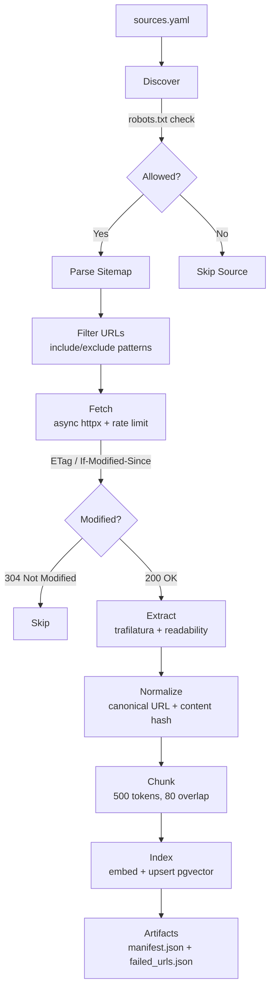
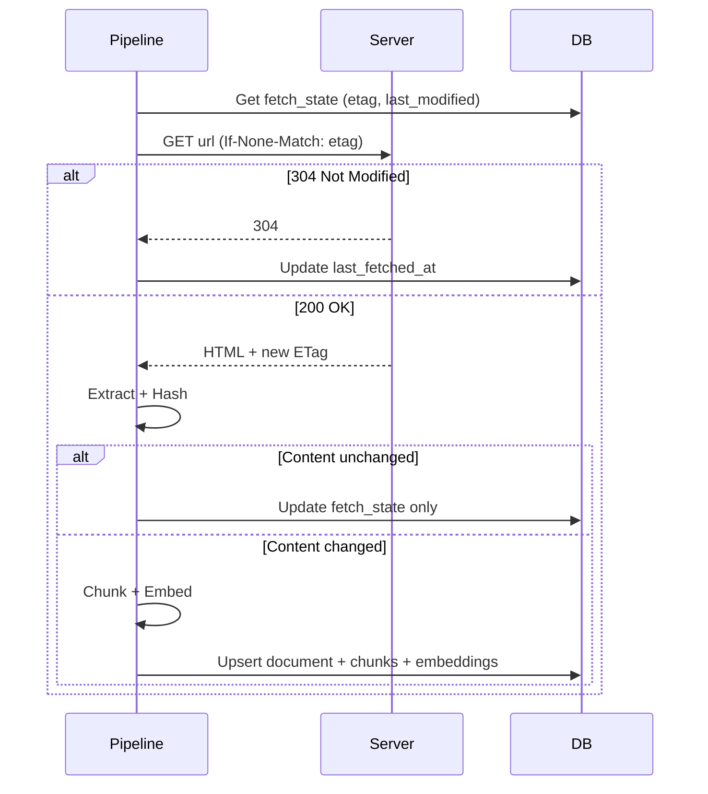

# Ingestion Pipeline

## Overview

The ingestion pipeline discovers, fetches, extracts, chunks, and indexes content from configured Georgia Tech sources.

## Pipeline Diagram



## sources.yaml Schema

```yaml
sources:
  - name: gt-registrar                  # Unique identifier
    base_url: https://registrar.gatech.edu
    allowed: true                        # Policy gate
    reason: "Official GT registrar"      # Why allowed/blocked
    sitemap_url: https://registrar.gatech.edu/sitemap.xml
    include_patterns:                    # URL path must contain one of these
      - "/calendar"
      - "/registration"
    exclude_patterns:                    # URL path must NOT match these
      - "/node/"
    max_urls: 100                        # Safety ceiling; exceeding fails planning
    refresh_policy:
      schedule: daily
      method: sitemap_incremental
```

## Incremental Updates

The pipeline uses **conditional HTTP requests** to avoid re-fetching unchanged content:

1. **ETag**: Stored per URL in `fetch_state`. Sent as `If-None-Match` header.
2. **Last-Modified**: Sent as `If-Modified-Since` header.
3. **Content hash**: SHA-256 of extracted text. If hash matches existing document, skip re-indexing.

## Controlled Registrar and Catalog manifests

Registrar and Catalog use source-specific discovery adapters. A fresh production run discovers
the official index once, allowlists and canonicalizes every URL, deduplicates it, then checks the
configured `max_urls` safety ceiling. URLs are never silently truncated: exceeding the ceiling
fails before planning with `MAX_URLS_EXCEEDED`.

Full source runs are operator initiated:

```bash
make sync-doc-many source=gt-registrar
make sync-doc-many source=gt-catalog
```

The explicit verification limit is only for bounded smoke tests and is applied after the safety
ceiling succeeds:

```bash
make sync-doc-many source=gt-registrar verification_limit=2
make sync-doc-many source=gt-catalog verification_limit=2
```

Resume uses the immutable stored manifest and does not rediscover URLs:

```bash
make resume-doc-run source=gt-registrar run_id=<RUN_ID>
```

Each canonical URL is committed independently. Failed URL updates roll back and preserve the
previous document, chunks, and embeddings; the runner never deletes documents implicitly.
HTML documents must have a nonblank title and body, must not match a recognized login/block/error
page, and must produce at least one fully embedded chunk. Quality failures are recorded as
`EXTRACT_FAILED` with reason `QUALITY_GATE_FAILED` and leave trusted data unchanged.



## Robots.txt Compliance

Before fetching any URL, the pipeline:
1. Fetches `robots.txt` for the source domain
2. Checks each URL against the robots rules for `BuzzBot/1.0` user-agent
3. Skips disallowed URLs

## Rate Limiting

- **Per-domain rate limiter**: configurable via `INGEST_RATE_LIMIT_PER_DOMAIN` (default: 2 req/s)
- **Concurrency semaphore**: `INGEST_CONCURRENCY` (default: 5)
- **Exponential backoff**: 3 retries with 2-15s delays

## Artifacts

Each run produces:
- `artifacts/manifest.json`: per-source stats (fetched, indexed, skipped, failed counts)
- `artifacts/failed_urls.json`: list of URLs that failed with error details

## Common Crawl (Optional)

Enable with `ENABLE_COMMONCRAWL=true`. Restricted to:
- `gatech.edu`
- `registrar.gatech.edu`
- `catalog.gatech.edu`

**RateMyProfessors is never included.**

## Monitoring

- Structured logs with `structlog` (request IDs, source names, URL counts)
- Artifacts uploaded as GitHub Actions artifacts on nightly runs
- `GET /stats` endpoint shows document/chunk counts

## Versioned OSCAR Schedule Runs

OSCAR schedule rows use a separate structured pipeline and are published atomically per
`term:subject`. A term run discovers the offered subjects once, stores that immutable plan in
PostgreSQL, and records each subject result for resume.

Fresh full-term run (operator initiated):

```bash
make sync-oscar-all term=202608
```

Bounded one-subject run:

```bash
python3 -m ingestion.schedule.sync_term \
  --term 202608 \
  --probe-subject CS \
  --probe-course 7650 \
  --subjects CS \
  --concurrency 1
```

Resume the original fixed manifest without rediscovery:

```bash
python3 -m ingestion.schedule.sync_term --run-id <run-uuid> --resume
```

Retry selected failed units in that manifest:

```bash
python3 -m ingestion.schedule.sync_term \
  --run-id <run-uuid> \
  --resume \
  --retry-failed ARCH,ECE
```

An authentication response fails the run globally. A 429 pauses new scheduling, honors
`Retry-After` or bounded backoff, and leaves the run resumable if the retry budget is exhausted.
Failed or partial subject collections never replace the last published version.

An official OSCAR listing that contains the recognized no-results message is published as a
verified-empty `term:subject` version with zero rows. This supersedes an older non-empty version so
stale offerings cannot remain authoritative. Any other HTTP 200 response that produces zero
sections remains a parse failure and cannot publish.

## Run 3 official document profile

Run 3 composes the existing URL runner across every source tagged `run3`. Discovery completes for
all sources before execution. The parent run stores an immutable `source + URL + adapter + vertical`
manifest in `ingestion_runs.scope_json`; short `source:position` keys are stored in
`ingestion_run_units`. Resume uses that snapshot and does not rediscover.

Production run (operator initiated; performs paid embeddings only for changed documents):

```bash
make migrate
make sync-gt-all
```

Bounded verification is global and is applied only after every source passes discovery and its
`max_urls` safety ceiling:

```bash
make sync-gt-all verification_limit=2
```

Resume a paused or partial run. Failed units are reset within the same immutable manifest; completed
units are not fetched again:

```bash
make resume-gt-all run_id=<RUN_ID>
```

Expected JSON includes `status`, aggregate counts, the immutable `planned_units`, and per-vertical
`planned/succeeded/failed/remaining` counts. `COMPLETED` means every planned URL succeeded;
`PARTIAL` preserves successful and previously trusted documents; repeated 429 returns `PAUSED`;
authentication is a hard `FAILED` stop.

HTML and PDF share the same transactional document/chunk/embedding publish path. PDF ingestion uses
embedded text only, limits resources to 10 MiB and 200 pages, chunks each page independently, and
adds `page_start/page_end` metadata used by API citations. Scanned, encrypted, malformed, oversized,
or textless PDFs fail closed. OCR is intentionally deferred.
