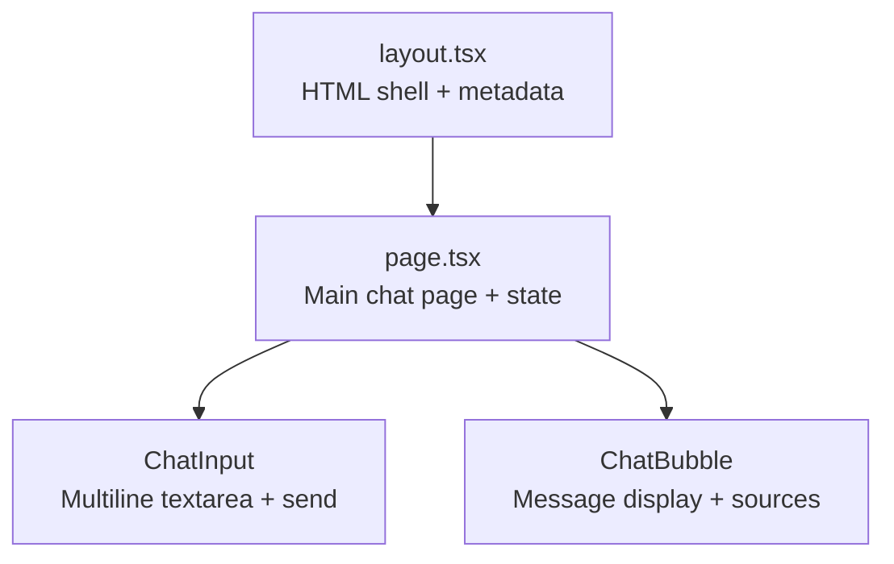
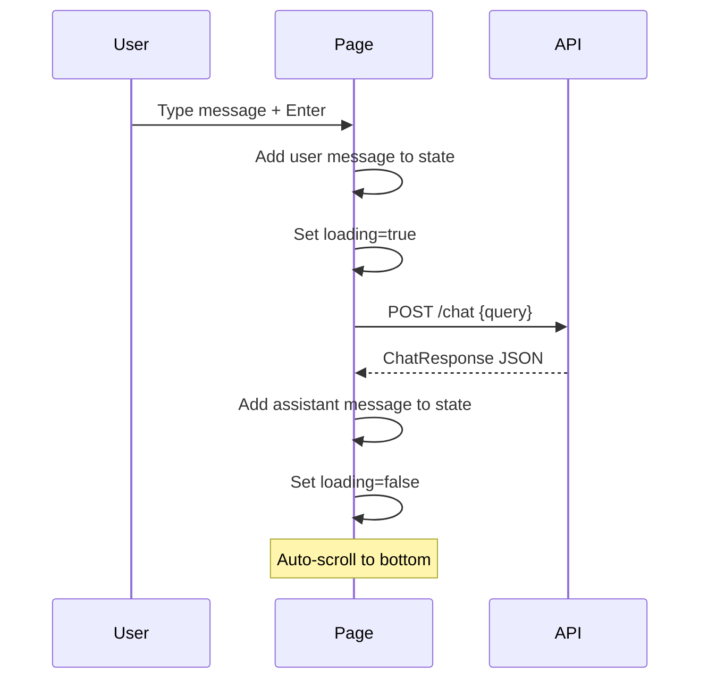

# UI Guide

## Overview

BuzzBot's frontend is a Next.js 14 (App Router) application with Tailwind CSS, providing a responsive chat interface.

## Component Structure



## Components

### `page.tsx` (Main Page)
- Manages chat message state (`Message[]`)
- Handles API calls to `POST /chat`
- Loading/error state management
- Suggested questions on empty state
- Clear chat and debug toggle buttons

### `ChatBubble`
- Renders user (navy, right-aligned) and assistant (white, left-aligned) messages
- **Sources accordion**: expandable panel showing citations with title, URL, fetched date, and quote
- **Copy button**: copies answer text to clipboard
- **Confidence badge**: color-coded (green/yellow/red) percentage
- **Debug info**: shows intent, live fetch status, chunk count (toggle)

### `ChatInput`
- Auto-resizing textarea (up to 150px)
- **Enter** to send, **Shift+Enter** for newline
- Disabled state during loading

## State Flow



## Styling

- **Georgia Tech colors**: Navy (#003057), Gold (#B3A369), Blue (#004F9F)
- **Responsive**: mobile-first layout with max-width constraints
- **Chat bubbles**: rounded corners with directional tails
- **Custom scrollbar**: thin, subtle

## Configuration

| Env Variable | Default | Description |
|-------------|---------|-------------|
| `NEXT_PUBLIC_API_BASE` | `http://localhost:8000` | Backend API URL |

## Running

```bash
cd frontend
npm install
npm run dev     # http://localhost:3000
```

## Screenshots

> Screenshots can be captured after running the full stack. The UI includes:
> 1. Welcome screen with suggested questions
> 2. Chat with user/bot bubbles
> 3. Expanded sources panel
> 4. Loading indicator
> 5. Error banner
> 6. Mobile responsive view
